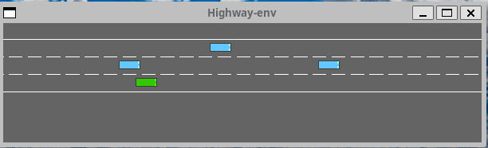

# Highway-env DQN

This project is a reinforcement learning implementation of the [highway-env environment](https://github.com/Farama-Foundation/HighwayEnv). The environment is a highway with 3 lanes and other vehicles. The agent is a car that has to learn how to drive in the highway without crashing. The agent is rewarded for driving fast and penalized for crashing. The agent is trained using a Deep Q Network (DQN) algorithm.

  <figcaption>Random Agent</figcaption>
  
    <figcaption>DQN Agent</figcaption>
    
    

## Video Demo

## Install dependencies with docker

For this project a docker container was created. Please follow these steps to setup the environment (you should be in the same path as the dockerfile):

1. Build Dockerfile

    `docker build -t highway:pytorch .`

2. Create container (this assumes you want to run the project on GPU)

    ``docker run --name highwayenv -p 8888:8888 -p 5252:5252 -v /tmp/.X11-unix:/tmp/.X11-unix -e DISPLAY=$DISPLAY -v `pwd`:/project -it --env QT_X11_NO_MITSHM=1 --device /dev/dri --privileged --gpus all --ipc=host highway:pytorch ``

* Ports open to work with this container are set to 5151 and 5252 if you require different ports feel free to modify them.

3. Everytime we want to run container

    `docker start highwayenv`

    `docker exec -it highwayenv bash`

